# Next.js Dashboard Tutorial Notes

## Chapter 1 — Getting Started

### Що зробив:
- Встановив pnpm глобально через npm
- Створив Next.js проєкт через `create-next-app` зі starter example
- Запустив `pnpm approve-builds` щоб дозволити build scripts для `bcrypt` і `sharp`
- Встановив залежності через `pnpm i`
- Запустив dev сервер через `pnpm dev`
- Відкрив `http://localhost:3000` — з'явилась unstyled сторінка

### Структура проєкту:
- `/app` — роути, компоненти, логіка
- `/app/lib` — утиліти, функції для fetching даних, placeholder data
- `/app/ui` — UI компоненти
- `/public` — статичні файли

### Нотатки:
- Проєкт написаний на TypeScript — типи визначені вручну в `definitions.ts`
- Placeholder data в `placeholder-data.ts` імітує реальну базу даних
- pnpm швидший за npm/yarn

### Скріншоти:
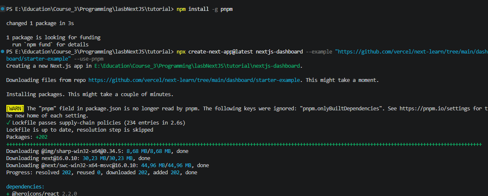
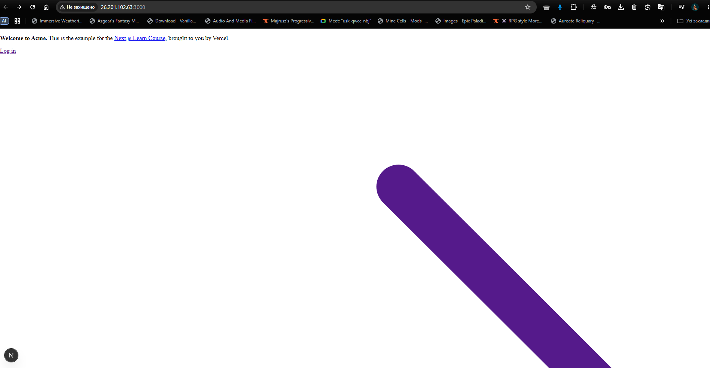

## Chapter 2 — CSS Styling

### Що зробив:
- Додав `import '@/app/ui/global.css'` в `/app/layout.tsx`
- Протестував Tailwind — додав чорний трикутник в `page.tsx`
- Створив `/app/ui/home.module.css` з класом `.shape`
- Замінив Tailwind трикутник на CSS Module версію

### Ключові концепції:
- `global.css` з `@tailwind` директивами застосовує стилі глобально
- Tailwind — utility класи прямо в JSX (`className="text-blue-500"`)
- CSS Modules — scoped стилі, без конфліктів класів
- `clsx` — умовне перемикання класів залежно від стану

### Нотатки:
- Tailwind зручніший для швидкої розробки, але CSS Modules краще для ізоляції стилів
- `clsx` вирішує проблему умовних класів без шаблонних рядків

### Скріншоти:
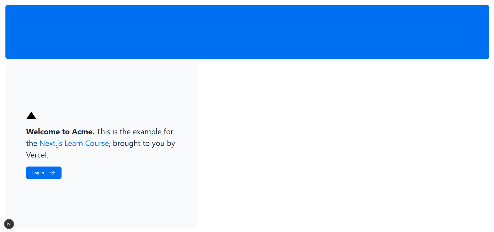

## Chapter 3 — Optimizing Fonts and Images

### Що зробив:
- Створив `/app/ui/fonts.ts` з шрифтами Inter (основний) і Lusitana (додатковий)
- Додав Inter до `<body>` в `layout.tsx` з класом `antialiased`
- Застосував Lusitana до `
` елемента в `page.tsx`
- Розкоментував компонент `<AcmeLogo />`
- Додав desktop hero image через `next/image` (прихований на мобільних)
- Додав mobile hero image (прихований на десктопі)

### Ключові концепції:
- `next/font` завантажує шрифти під час білду — без додаткових мережевих запитів
- Cumulative Layout Shift (CLS) — метрика Google для оцінки стабільності верстки
- `next/image` автоматично: lazy loading, resize, WebP формат, запобігає layout shift
- `width` і `height` в `<Image>` — розміри оригінального файлу для aspect ratio

### Нотатки:
- Next.js хостить шрифти разом зі статичними файлами — розумне рішення для продуктивності
- `hidden md:block` і `block md:hidden` — зручний Tailwind патерн для responsive зображень

### Скріншоти:
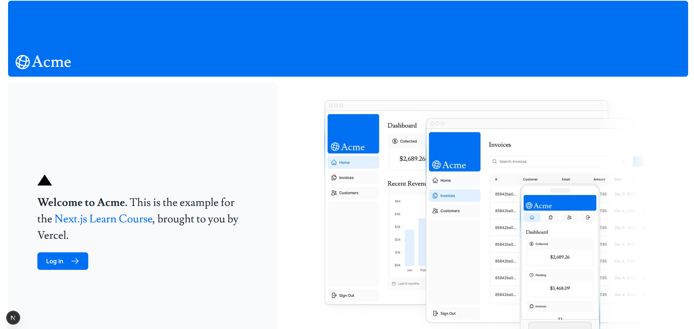

## Chapter 4 — Creating Layouts and Pages

### Що зробив:
- Створив `/app/dashboard/page.tsx` — сторінка `/dashboard`
- Створив `/app/dashboard/customers/page.tsx` — сторінка `/dashboard/customers`
- Створив `/app/dashboard/invoices/page.tsx` — сторінка `/dashboard/invoices`
- Створив `/app/dashboard/layout.tsx` з компонентом `<SideNav />`

### Ключові концепції:
- File-system routing — папки визначають роути, `page.tsx` робить роут доступним
- `layout.tsx` — спільний UI для кількох сторінок
- Partial rendering — при навігації оновлюється тільки `page.tsx`, layout не ре-рендериться
- Colocation — UI компоненти, тести і код можна тримати поряд з роутами
- Root layout (`/app/layout.tsx`) — обов'язковий, застосовується до всіх сторінок

### Нотатки:
- Зручно що layout автоматично огортає всі дочірні сторінки через `children`
- Partial rendering зберігає React state при переходах між сторінками

### Скріншоти:

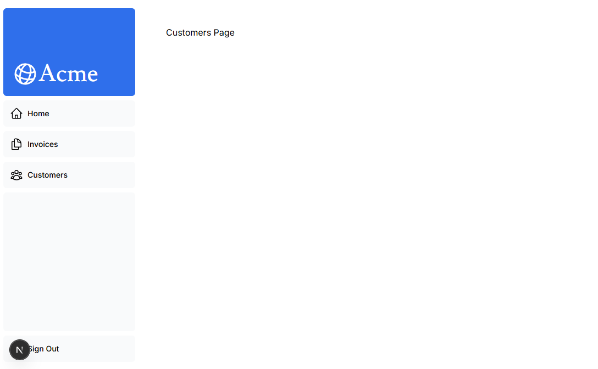

## Chapter 5 — Navigating Between Pages

### Що зробив:
- Замінив `<a>` теги на `<Link>` компонент в `nav-links.tsx`
- Додав `'use client'` directive бо використовується хук
- Додав `usePathname()` хук для отримання поточного шляху
- Використав `clsx` для підсвічування активного посилання синім

### Ключові концепції:
- `<Link>` — клієнтська навігація без повного перезавантаження сторінки
- `usePathname()` — хук для отримання поточного URL шляху
- Automatic code-splitting — Next.js ділить код по роутах, кожна сторінка ізольована
- Prefetching — в продакшні Next.js автоматично prefetch-ить код для посилань у viewport

### Нотатки:
- `'use client'` потрібен бо хуки працюють тільки на клієнті
- Prefetching робить навігацію майже миттєвою — код вже завантажений до кліку

### Скріншоти:
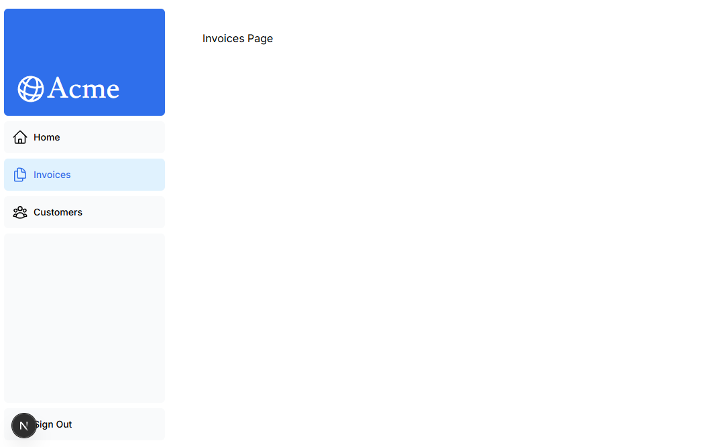

## Chapter 6 — Setting Up Your Database

### Що зробив:
- Створив акаунт на Vercel і підключив GitHub репозиторій
- Задеплоїв проєкт на Vercel
- Створив PostgreSQL базу даних через Neon
- Скопіював `.env.local` secrets і вставив в `.env` файл
- Засіяв базу даних через `localhost:3000/seed`
- Розкоментував `app/query/route.ts` і перевірив запит через `localhost:3000/query`

### Ключові концепції:
- Seeding — заповнення бази початковими даними
- `.env` файл зберігає секрети підключення до бази (не пушити в GitHub!)
- Vercel автоматично деплоїть при пуші в `main` гілку

### Нотатки:
- База вже була частково засіяна — помилка `23505` не критична
- SQL запит повернув `Evil Rabbit` з amount `666`

### Скріншоти:
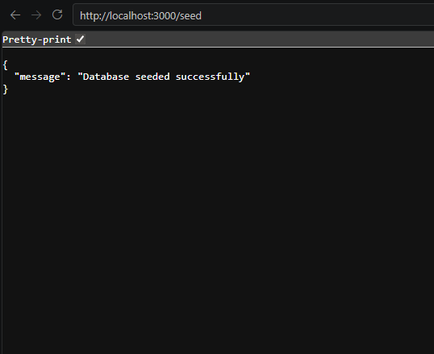
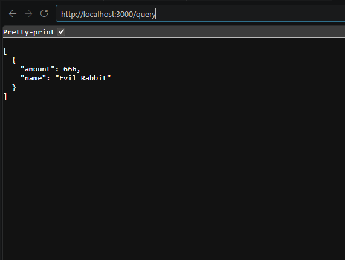

## Chapter 7 — Fetching Data

### Що зробив:
- Додав `fetchRevenue`, `fetchLatestInvoices`, `fetchCardData` в `dashboard/page.tsx`
- Розкоментував компоненти `<RevenueChart />` і `<LatestInvoices />`
- Розкоментував код в `revenue-chart.tsx` і `latest-invoices.tsx`
- Dashboard тепер показує реальні дані з бази

### Ключові концепції:
- Server Components дозволяють робити `async/await` без `useEffect`
- Можна звертатись до бази напряму без API layer
- Request waterfall — запити виконуються послідовно, кожен чекає попереднього
- `Promise.all()` — паралельне виконання запитів, швидше за waterfall
- SQL краще за JS для фільтрації — менше даних передається по мережі

### Нотатки:
- Waterfall не завжди погано — іноді потрібно чекати результат попереднього запиту
- `fetchCardData` використовує `Promise.all()` — всі три запити виконуються паралельно

### Скріншоти:
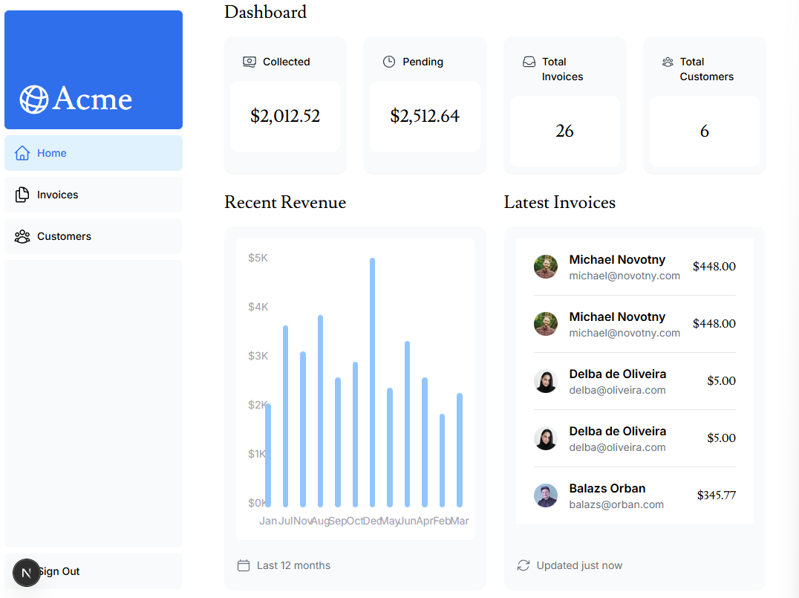

## Chapter 8 — Static and Dynamic Rendering

### Що зробив:
- Розкоментував `console.log` і `setTimeout` в `fetchRevenue()` для симуляції повільного запиту
- Переконався що сторінка завантажується 3 секунди
- Побачив логи в консолі браузера: `Fetching revenue data...` і `Data fetch completed after 3 seconds.`

### Ключові концепції:
- Static rendering — рендер на сервері під час білду, результат кешується
- Dynamic rendering — рендер на сервері при кожному запиті користувача
- Static rendering підходить для незмінного контенту (блог, продуктова сторінка)
- Dynamic rendering підходить для персоналізованих даних (дашборд, профіль)
- Проблема dynamic rendering: додаток такий же повільний як найповільніший запит

### Нотатки:
- Cookies і URL search params доступні тільки під час request time — тільки dynamic rendering
- Весь дашборд блокується поки `fetchRevenue` не завершиться — це проблема

### Скріншоти:
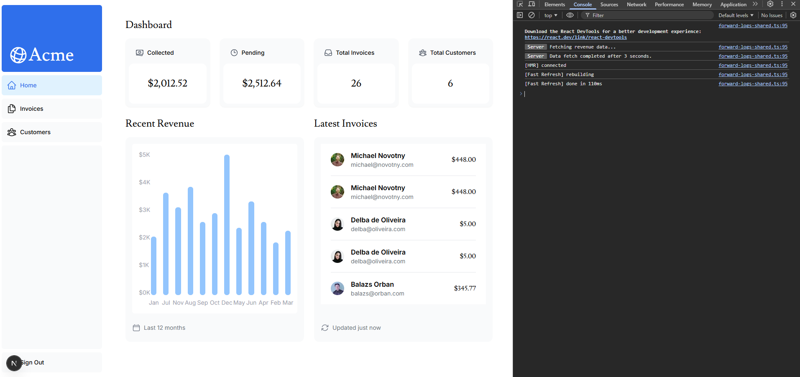

## Chapter 9 — Streaming

### Що зробив:
- Створив `/app/dashboard/loading.tsx` з `<DashboardSkeleton />`
- Створив папку `/(overview)` і перемістив туди `page.tsx` і `loading.tsx`
- Обернув `<RevenueChart />`, `<LatestInvoices />`, `<CardWrapper />` в `<Suspense>`
- Перемістив fetch функції в самі компоненти
- `revenue-chart.tsx` — сам фетчить `fetchRevenue()`
- `latest-invoices.tsx` — сам фетчить `fetchLatestInvoices()`
- `cards.tsx` — `CardWrapper` сам фетчить `fetchCardData()`

### Ключові концепції:
- Streaming — розбиває сторінку на chunks, кожен стримується окремо
- `loading.tsx` — спеціальний файл Next.js, автоматично створює `<Suspense>`
- `<Suspense>` — показує fallback поки компонент завантажує дані
- Route Groups `/(overview)` — групування файлів без впливу на URL
- Skeleton — спрощений UI як placeholder під час завантаження

### Нотатки:
- Раніше вся сторінка чекала 3 секунди через `fetchRevenue`
- Тепер картки і Latest Invoices видні одразу, тільки графік чекає
- Переміщення fetch в компоненти — хороша практика для granular streaming

### Скріншоти:
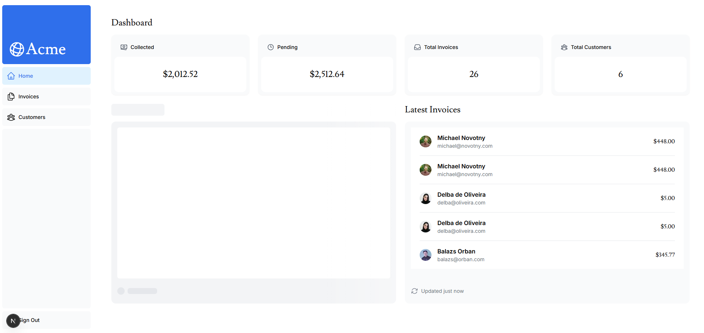

## Chapter 10 — Adding Search and Pagination

### Що зробив:
- Оновив `/app/dashboard/invoices/page.tsx` — додав `searchParams` prop
- Оновив `/app/ui/search.tsx` — додав `useSearchParams`, `usePathname`, `useRouter`
- Встановив `use-debounce` і застосував `useDebouncedCallback` з затримкою 300ms
- Пошук оновлює URL без перезавантаження сторінки
- `<Table />` отримує `query` і `currentPage` з URL

### Ключові концепції:
- URL search params — зберігають стан пошуку в URL (bookmarkable, shareable)
- `useSearchParams` — хук для читання URL params на клієнті
- `usePathname` — хук для отримання поточного шляху
- `useRouter.replace` — оновлює URL без перезавантаження
- Debouncing — затримка виконання функції, зменшує кількість запитів до БД
- `defaultValue` vs `value` — використовуємо `defaultValue` бо стан в URL, не в React state

### Нотатки:
- Client компоненти використовують хуки для читання params
- Server компоненти отримують params через props від page
- Без debouncing — запит до БД на кожен символ, з debouncing — тільки після зупинки

### Скріншоти:
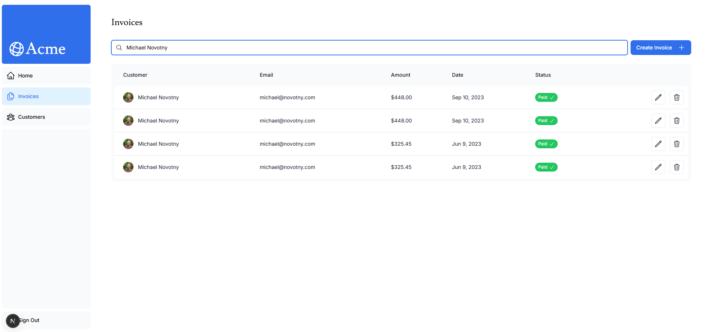

## Chapter 11 — Mutating Data

### Що зробив:
- Створив `/app/lib/actions.ts` з Server Actions: `createInvoice`, `updateInvoice`, `deleteInvoice`
- Створив сторінку `/dashboard/invoices/create/page.tsx`
- Створив динамічний роут `/dashboard/invoices/[id]/edit/page.tsx`
- Підключив `createInvoice` до форми створення
- Підключив `updateInvoice` через `.bind()` до форми редагування
- Підключив `deleteInvoice` до кнопки видалення

### Ключові концепції:
- Server Actions — асинхронні функції що виконуються на сервері, не потребують API endpoints
- `'use server'` — директива що позначає функції як Server Actions
- Zod — бібліотека для валідації типів даних з форми
- `z.coerce.number()` — конвертує рядок в число (бо `input type="number"` повертає string)
- Суми зберігаються в центах щоб уникнути floating-point помилок
- `revalidatePath` — очищає кеш роуту після мутації
- `redirect` — перенаправляє користувача після успішної дії
- `.bind(null, id)` — передає id в Server Action без hidden input
- Dynamic route `[id]` — папка в квадратних дужках створює динамічний сегмент

### Нотатки:
- Server Actions автоматично створюють POST endpoint — не потрібно писати API вручну
- Progressive Enhancement — форми працюють навіть без JavaScript
- UUID безпечніші за auto-increment ID бо не дозволяють перебирати записи

### Скріншоти:
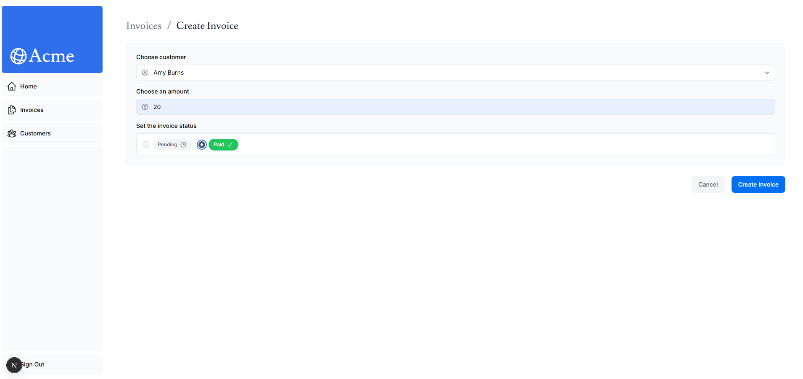
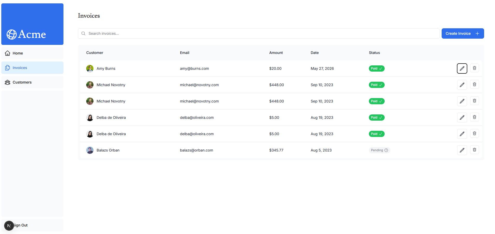
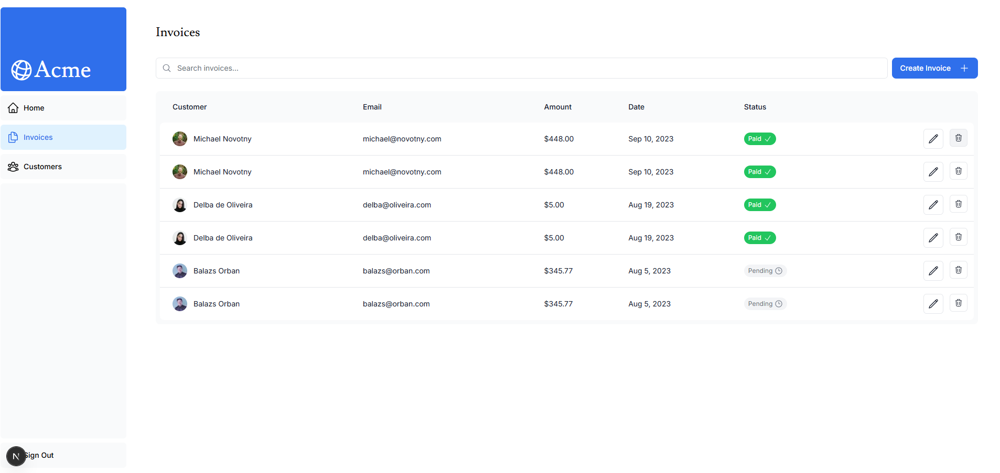

## Chapter 12 — Handling Errors

### Що зробив:
- Додав `try/catch` в Server Actions: `createInvoice`, `updateInvoice`, `deleteInvoice`
- Створив `/dashboard/invoices/error.tsx` — catch-all для непійманих помилок
- Додав `notFound()` в edit page коли інвойс не існує
- Створив `/dashboard/invoices/[id]/edit/not-found.tsx` — UI для 404

### Ключові концепції:
- `try/catch` в Server Actions — перехоплює помилки БД і повертає повідомлення
- `redirect` викликається ПОЗА `try/catch` — бо redirect кидає помилку всередині, яку catch перехопить
- `error.tsx` — спеціальний файл Next.js, catch-all для непійманих виключень у route segment
- `'use client'` — error.tsx обов'язково Client Component (використовує `useEffect`, `onClick`)
- `error` prop — екземпляр JavaScript Error об'єкта
- `reset` prop — функція що пробує перерендерити route segment
- `notFound()` — функція з `next/navigation`, показує 404 UI
- `not-found.tsx` — файл що рендериться коли викликається `notFound()`
- `notFound` має пріоритет над `error.tsx` для більш специфічних помилок

### Нотатки:
- `error.tsx` ловить все що не піймано — універсальний fallback
- `not-found.tsx` — більш специфічний, для ресурсів яких не існує
- Помилки БД краще логувати на сервері, а користувачу показувати загальне повідомлення

### Скріншоти:
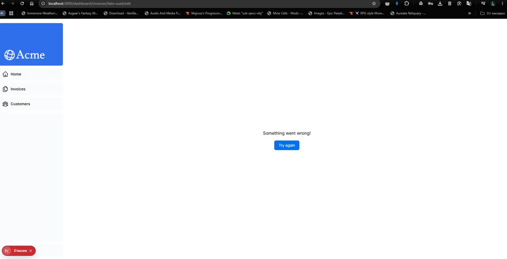
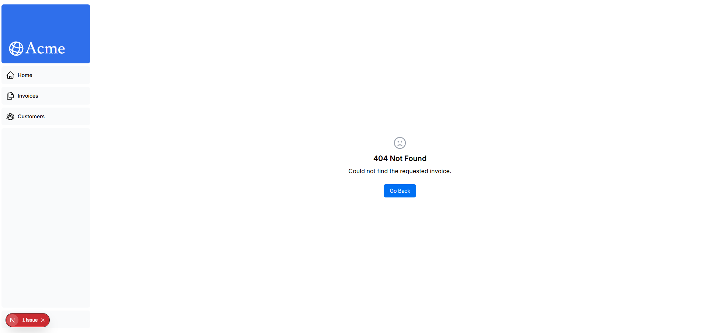